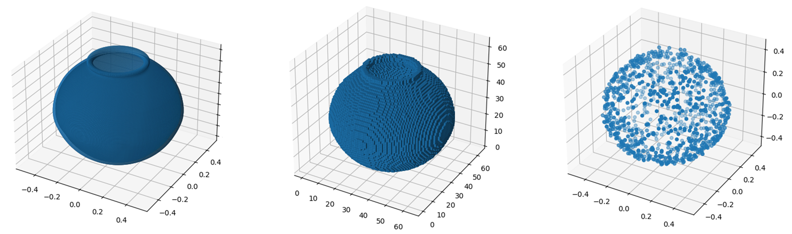

# Voxel fragmentation

 
 
 
 
 
 

GPU-based fragmentation of voxelizations using OpenGL compute shaders. This project is aimed at generating datasets for training fragment assembly models. While this fragmentation method can be applied over any mesh, this work specifically focus on archaeological artefacts such as those depicted in *Figure 1*.

 

     
    <em>Figure 1. Assembled fragments of Iberian vessels.</em>

## Dependencies

The code in this repository has some dependencies which are following listed:

- assimp 5.2.4.
- glew 2.2.0.
- opengl 4.6.
- glfw3 3.3.7.
- glm 0.9.9.8.
- [simplify](https://github.com/sp4cerat/Fast-Quadric-Mesh-Simplification).
- [MagicaVoxel File Writer](https://github.com/aiekick/MagicaVoxel_File_Writer).

**_*The last two dependencies were already included as part of this repo, under the folder `MeshFragments/Libraries/`._**

## Windows

The project is primarily intended to be used in Windows. The Microsoft Visual Studio project files are uploaded to the repo and therefore it should be trivial to open it (regardless of changing the development platform kit). The project was configured as follows:

- Development platform kit: `v143`.
- Language standard: `C++ 23`.
- Integration with `vcpkg`. After cloning `vcpkg` and launching the main `.bat`, it can be integrated with MSVC by executing `vcpkg integrate install` in the command line (note that `vcpkg` can be registered in the system path for easier usage).

## Data download

The fragment data is available at <a href="https://s5-ceatic.ujaen.es/fragment-dataset-uja/">our research institute's page</a>. Please, note that there are two datasets; one is split into eight files since it is approximately 450GB, whereas the other (`vessels_200_obj_ply_no_zipped.zip`) is lighter (27 GB). The latter is intended for testing the dataset since it only contains decimated fragments of 200 models, with no individual zipping. However, note that these are provided as triangle meshes and point clouds derived from marching cubes, and may have more geometric inaccuracies. 

Otherwise, please go to `decompress` folder to learn how to decompress binary files (triangle meshes, point clouds and voxelizations). Point clouds are decompressed in C++ using the Point Cloud Library, whereas the others are decompressed using Python.

    
    <em>Figure 2. Rendering uncompressed data.</em>

## Citation

    @article{LopezGenerating2024,
        title = {Generating implicit object fragment datasets for machine learning},
        journal = {Computers & Graphics},
        pages = {104104},
        year = {2024},
        issn = {0097-8493},
        doi = {https://doi.org/10.1016/j.cag.2024.104104},
        url = {https://www.sciencedirect.com/science/article/pii/S0097849324002395},
        author = {Alfonso López and Antonio J. Rueda and Rafael J. Segura and Carlos J. Ogayar and Pablo Navarro and José M. Fuertes},
        keywords = {Voxel, Fragmentation, Fracture dataset, Voronoi, GPU programming}
    }
